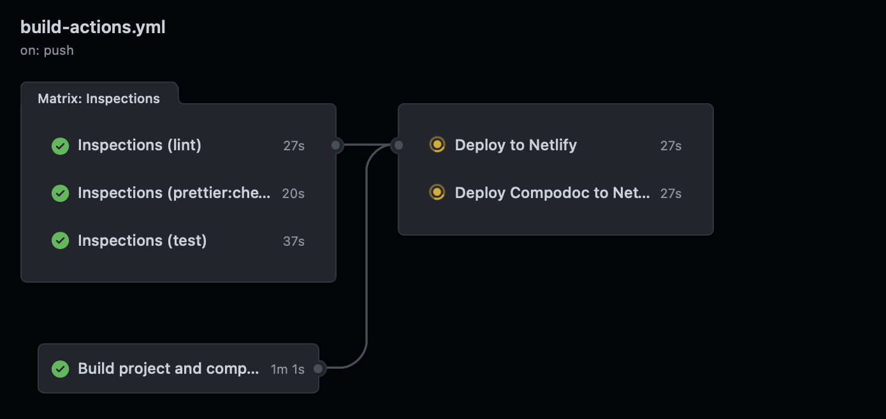

# Jokenpo

This is a home task project to create a Jokenpo game in Angular.

- [Jokenpo](#jokenpo)
  - [Deploy status](#deploy-status)
  - [Board with tasks](#board-with-tasks)
  - [URL deployed](#url-deployed)
  - [Resources used](#resources-used)
  - [Requirements to run](#requirements-to-run)
  - [How to install dependencies](#how-to-install-dependencies)
  - [Scripts Available](#scripts-available)
  - [Husky](#husky)
  - [Tests](#tests)
    - [Unit tests](#unit-tests)
    - [Snapshot tests](#snapshot-tests)
    - [Integration tests](#integration-tests)
    - [End to End tests](#end-to-end-tests)
    - [Testing folder](#testing-folder)
  - [Code design](#code-design)
    - [Architecture diagram](#architecture-diagram)
    - [Modules](#modules)
    - [QueryParams](#queryparams)
  - [Considerations](#considerations)
  - [Possible improvements](#possible-improvements)
  - [Deploy](#deploy)
    - [Deploy requirements](#deploy-requirements)
    - [Docker](#docker)
    - [Using Github Actions and Deploying into Netlify](#using-github-actions-and-deploying-into-netlify)
  - [Author](#author)
  - [License](#license)

## Deploy status

| Branch          | Status                     | 
|-----------------|----------------------------|
| Application          | [](https://app.netlify.com/sites/jokenpo-game-adrian/deploys) |
| Documentation | [](https://app.netlify.com/sites/jokenpo-adrian-docs/deploys) |
## Board with tasks

If you would like to check how I organize my tasks, you can check my board on Trello [here](https://trello.com/b/wX98RPXL/anaconda-home-task)

## URL deployed

If you want to test the application deployed you can check [here](https://jokenpo-game-adrian.netlify.app) and if you'd like to check the static documentation generated by compodoc, check [here](https://jokenpo-adrian-docs.netlify.app).
## Resources used

* [Angular](http://angular.io) - Framework used. Version 13 choose, is the last one until the moment.
* [Node](https://nodejs.org/) - Need to run the project.
* [NPM](https://www.npmjs.com) - Manage dependencies.
* [Jest](http://jestjs.io) - Framework used for testing purpose, need for specs, spies, stubs, assertions and also supply the test runner to run the specs.
* [Testing Library](http://testing-library.com) - Cross-platform library to help with a set of utilities to be able to make integration tests easily.
*  [Material IO](https://material.angular.io) - Style library with Angular components based on Material UI
*  [Docker](https://www.docker.com) - To create containers and help to ship the project to run in an environment with support (like k8s)
*  [Netlify](https://www.netlify.com) - Netlify unites an entire ecosystem of modern tools and services into a single, simple workflow for building high performance sites and apps.
* [NgBootstrap](https://ng-bootstrap.github.io/#/home) - Used for the carousel component
## Requirements to run

* NodeJS LTS version v16.13.1
* VSCode
* GIT
* Angular/CLI version 13.2.5
* Chrome, Safari or Firefox - In my tests should work in all those browsers, however Chrome is where I've tested most of my time.
## How to install dependencies

Install dependencies with:

```
npm ci
```

If you want to update the package-lock.json with the possible latest versions, run:

```
npm install
```

## Scripts Available
npm start -  Run `ng serve` for a dev server. Navigate to `http://localhost:4200/`. The app will automatically reload if you change any of the source files.

*npm run build - Run `ng build` to build the project. The build artifacts will be stored in the `dist/` directory.

*npm test - Run `ng test` to execute the test suite with [Jest](http://jestjs.io)

*npm run test:watch - Run `npm test` and execute tests with --watch flag mode

*npm run test:e2e - Run `ng e2e` to execute the end-to-end tests via a platform of your choice. To use this command, you need to first add a package that implements end-to-end testing capabilities.

*npm run prettier:check - Will run the prettier in the project with the flag --check. This will let us know if we have files that have not been formatted.

*npm run prettier:apply - If you forgot to apply prettier in some of your files, you can simple run this command

*npm run lint - This command is to run eslint using the `.eslintrc.json` file rules

*npm run lint:fix - This command is to run eslint using the `.eslintrc.json` file rules and fix any error found

*npm run compodoc:build - Build compodoc and generate the documentation

*npm run compodoc:build-and-serve - It will generate the document and serve in the port `8080`.

*npm run compodoc:serve - If you already have compodoc files generated you can simple run the serve with this command, it will run on port `8080`
## Husky

I've added Husky to enable some hooks to run before commit and pushing code. I've added the following git hooks:

* pre-commit: In pre-commit I decide to run fast checkers: `npm run prettier:check` and `npm run lint`
* pre-push: In pre-push I decide to run all quality suite: `npm run prettier:check`, `npm run lint`, `npm run test` and `npm run build`
* commit-msg: use commit lint to enforce angular conventional and good commit messages

## Tests

### Unit tests

All my business layer it's covered with unit tests, we can for sure decouple the business layer and pass for a NodeJS service or even to another framework with only small adaptations
### Snapshot tests

I've added some snapshot tests for the components included on shared folder, since those components are only presentational components.

### Integration tests

I've created all the important tests in one place `jokenpo-game.component`, because this component will orchestrate the game. So inside this component I've also tested: `jokenpo-panel.component` and `shared module components`, all to see if the game is working

### End to End tests

With more time I would probably add tests with Cypress, but the random part for the computer x computer match would take me some time to understand how to properly test. So I've decided to skip those tests, since I've already have a good coverage of business covered already with integration tests.

### Testing folder

I've created two testing folder:

- src/testing - contains a TestingModule to help import testing modules and a dummy component to be reusable in mock routes
- src/app/jokenpo-game/jokenpo-game/testing - contains some files to help to make integration tests for the component. I didn't need to create this folder, but I've created to improve readability on the test file.

Both folders is excluded on jest.config and typescript build.
## Code design

All my decisions was to try decouple business layer from UI. If we need to extend the code in some point of the future we will only need to update the business layer. 

And inside the business layer we will have small changes on strategies and need to add new entities in the Hand model and also modified the factories.
### Architecture diagram
I've started the application by thinking about the model and how I would model the application. For doing this I've decided to use two design patterns: `Strategy` and `Factory`. 

The following diagram was my initial idea:


Some enums are not connected because they will be used across my component and views.

I have two factories:

* JokenpoStrategyFactory - responsible to return a strategy that match with the type passed.
* HandFactory - has two method to return the hand with the correspondent strategy. 
  * create: we pass the option type and return the correspondent hand
  * createHandRandom: it's a method to return with a random logic, a hand with strategy.
* As the logic to know which hand win of each hand (example: Rock x Paper), it's the logic we'd probably change in the future if we need to add a new hand, I isolated as a strategy, this way if we need to add a new hand we will not update the previous one, only the strategy layer. 

NOTE: Some methods and models were modified once I've started coding, the diagram was my initial idea and help me to setup everything fast and validate on paper first.
### Modules

* LayoutModule - Will have only the components shared across all routes, which is header and footer for this application. This module is for performance issues, because now we can have a `SharedModule` with the components used only in some views and not loading `SharedModule` every time.
* Core folder - All services, models, interfaces, enum, interfaces and independent files will be available here. 
* SharedModule - the modules to be shared across the application, today the components are used only in one place, to be honest those components could be inside the jokenpo-game module

### QueryParams

You probably might noticed in the route `game-session` where the game happens, I have a few parameters in the route, which is filled in the welcome view. I did that, because this way if the user wants to refresh the page, he won't loose the configurations. 

The options to avoid loosing the configurations would be localStorage or the way I did, for simplicity I thought better with queryParams.
## Considerations

* Moved Karma/Jasmine to Jest and Testing library, to have quick tests running and also to focus on integration tests with Testing library
* I've added husky to improve the quality of the code and guarantee I won't push break code to the environment.
* Probably I could done less things, but was fun for me to make the hometask and the game, that's why I took a few more days to complete the task with the things I consider good to show
  * Also It's been a while since the last time I've used angular (1 year ago), so it took some time to remember stuffs

## Possible improvements

* Add preview environment URL every time a PR is opened
* Add test coverage badge on Readme
* Add E2E tests to cover the core flows - I didn't add because I've already had a good number of integrations tests and I didn't prioritized 
* Add tests for the welcome view, I've decided to focus on the game, which was the core feature
* Also I could add some alerts on each rounds, to show who wins the round, for the user perspective sometimes might be confused or too fast to understand who won
* Also if the user try to open the `game-session` direct, without the config parameters, will redirect to welcome page without any user feedback, would be good to have some alert
## Deploy

To make the code shippable to production, I've setup two ways, the first one with Dockerfile and the second one with CI and Netlify.

### Deploy requirements

- Netlify account
- Docker installed
- Github account
- Git

### Docker

In the project directory, to build the application with Docker multistage you can build the image:

```docker build -t username/jokenpo .```

And then run your image:
```docker run --rm -it -p 3000:80 username/jokenpo```

After that, you can access the application with this URL in your browser:

```http://localhost:3000```


### Using Github Actions and Deploying into Netlify

Every code into `main` branch, trigger a pipeline with the following stages:

* Inspections: Run some commands to guarantee the quality of the code. All commands are executed in the order by time to be executed: faster -> longer
  * lint
  * prettier:check
  * test
* Build: Build and store the following artifacts
  * dist folder
  * documentation
* Deploy netlify - deploy the application from `dist` folder on Netlify
* Deploy netlify - deploy the static documentation generated inside the `documentation` folder on Netlify



## Author

  **Adrian Lemes Caetano** -  [GitHub](https://github.com/adrianlemess)

<a href="https://adrianlemess.github.io">
  
</a>

## License

This project is under [MIT license](LICENSE.md).